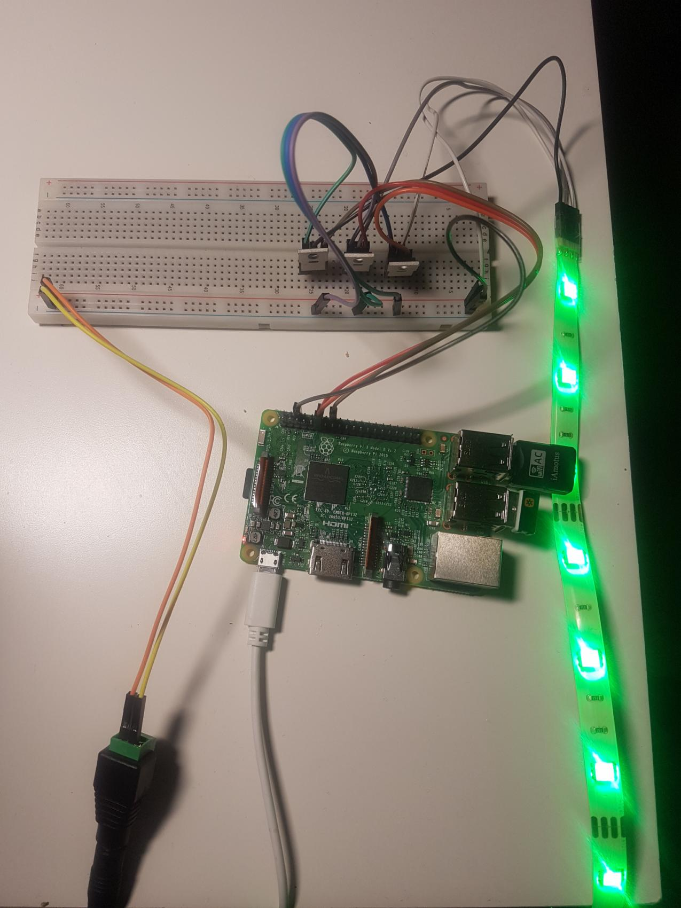

# led-mon
Represents the state of a private home server using a led-strip

The server is running on a raspberry pi and controls the led-strip via GPIO.

The client is running on the home server.

Current color codes are:

GREEN:

Everything is ok

YELLOW:

Updates are available

RED:

A problem with the RAID
